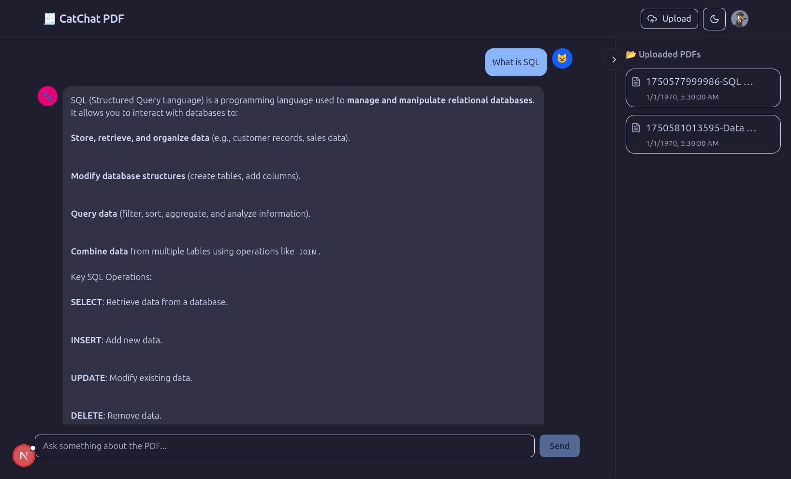

# 📚 AI PDF RAG Chat App

A modern AI-powered chatbot that allows users to upload large PDF files and chat with context-aware AI responses using Retrieval-Augmented Generation (RAG).

Built with:

- 🧠 OpenRouter / HuggingFace models for embeddings and generation
- 📦 Qdrant as the vector store
- 🧾 LangChain for chunking and semantic search
- ⚙️ BullMQ for background PDF processing
- 💬 Modern frontend using Catppuccin theme, Next.js, ShadCN, Tailwind CSS, and Framer Motion

---

## 🖼️ Demo

  
> Ask questions about your uploaded PDFs with instant AI answers!

---

## 📁 Features

- Upload and query any PDF document (books, contracts, papers, etc.)
- BullMQ-based background document processing
- Vector search with HuggingFace + Qdrant
- Markdown support and animated AI thinking in chat
- Responsive modern chat UI with collapsible sidebar
- Live PDF preview removed, files now open in new tab for simplicity
- Modern UI with Catppuccin theme + responsive chat interface

---

## 🛠️ Tech Stack

| Layer        | Tools & Services                              |
|--------------|-----------------------------------------------|
| Frontend     | Next.js 15, React 19, Tailwind CSS 4, ShadCN UI, Framer Motion, Catppuccin Theme |
| Backend API  | Node.js, Express, Multer, BullMQ              |
| AI / RAG     | LangChain, HuggingFace, OpenRouter, Qdrant    |
| Worker       | BullMQ, LangChain, PDFLoader, Qdrant JS SDK   |

---

## 🚀 Getting Started

### 1. Clone the Repo

```bash
git clone https://github.com/Sarcastic-Soul/AI-PDF-ChatApp.git
cd AI-PDF-ChatApp
```

### 2. Install Dependencies

Install dependencies for both frontend and backend:

```bash
# Install frontend dependencies
cd frontend
pnpm install

# Install backend dependencies
cd ../backend
pnpm install
```

### 3. Setup Environment Variables

#### Backend `.env`
Create a `.env` file in the root of `backend/`:

```env
OPENROUTER_API_KEY=your-openrouter-key
HF_API_KEY=your-huggingface-key
QDRANT_URL=http://localhost:6333
```

#### Frontend `.env.local`
Create a `.env.local` file in the root of `frontend/`:

```env
NEXT_PUBLIC_CLERK_PUBLISHABLE_KEY=your-clerk-publishable-key
CLERK_SECRET_KEY=your-clerk-secret-key
```

> Get your Clerk keys from [https://clerk.dev](https://clerk.dev) for authentication integration

### 4. Start Services

Start all services in the following order:

#### Start Docker Services (Redis & Qdrant)
```bash
# From the root directory
docker-compose up -d
```

#### Start Backend Server
```bash
# From the backend directory
cd backend
pnpm dev
```
Runs backend on [http://localhost:8000](http://localhost:8000)

#### Start Worker (in separate terminal)
```bash
# From the backend directory
cd backend
pnpm dev:worker
```
Processes uploaded PDFs in background and indexes content.

#### Start Frontend (in separate terminal)
```bash
# From the frontend directory
cd frontend
pnpm dev
```
Frontend runs on [http://localhost:3000](http://localhost:3000)

---

## 📤 API Endpoints

| Method | Route     | Description                   |
|--------|-----------|-------------------------------|
| POST   | `/upload` | Upload a PDF file             |
| POST   | `/chat`   | Ask a question about the PDF  |
| GET    | `/files`  | List uploaded PDF files       |
| GET    | `/pdf/:name` | Serve the uploaded PDF file |

---

## 📦 Docker Services

The project uses Docker Compose to run Redis (for BullMQ) and Qdrant (vector database):

```bash
# Start services
docker-compose up -d

# Stop services
docker-compose down
```

---

## 🧠 Frontend Stack Highlights

- `Next.js` with `Turbopack` for fast builds
- `Tailwind CSS 4` and `ShadCN UI` for styling and components
- `Framer Motion` for animations (line-by-line AI messages, loading states)
- `Catppuccin` theme support with `next-themes`
- `Lucide-react` icons, `react-markdown` for chat formatting

---

## 🙌 Acknowledgements

- [Youtube Tutorial](https://www.youtube.com/watch?v=2DXiOtEwWtU)
- [LangChain](https://www.langchain.com/)
- [OpenRouter](https://openrouter.ai)
- [Qdrant](https://qdrant.tech)
- [HuggingFace](https://huggingface.co)
- [Catppuccin Theme](https://catppuccin.com)

---

## 📄 License

MIT License © 2025 [Anish Kumar](https://github.com/Sarcastic-Soul)
